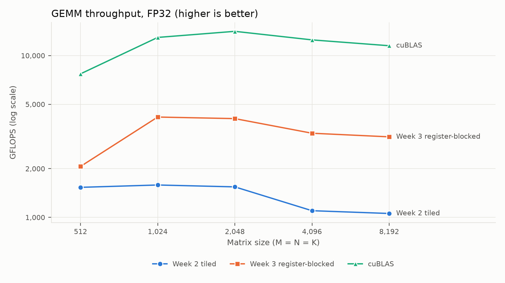
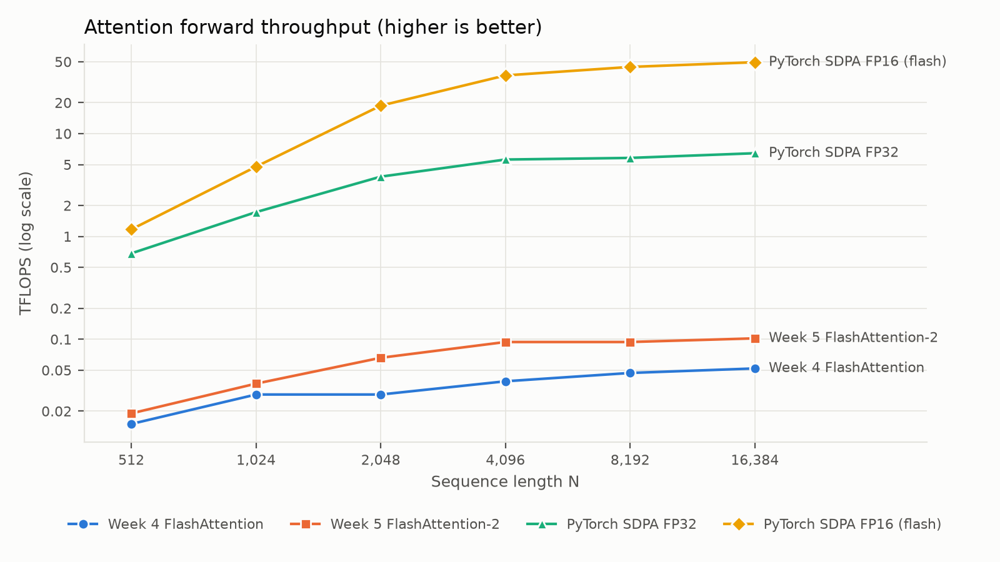

# HPC for AI: CUDA Coursework

Coursework from a high-performance computing for AI course at Northeastern University (Fall 2025). It starts with a multithreaded matrix multiply on the CPU, then builds CUDA kernels for GEMM, softmax and attention, and finishes with FlashAttention-2 (forward and backward), multi-GPU sequence-parallel attention and an expert-parallel Mixture-of-Experts layer.

Every kernel is benchmarked against cuBLAS or PyTorch and checked for correctness (see [Benchmarks](#benchmarks-nvidia-l4)). The benchmarks turned up two bugs, both now fixed (see [Bugs found by benchmarking](#bugs-found-by-benchmarking)).

## Contents

| Week | What I built | Files |
|---|---|---|
| 1 | Multithreaded matrix multiply in C with pthreads: correctness tests against a single-threaded version, and speedup vs. thread count (up to 4.8× on 500×500) | [`week_1/`](week_1/) |
| 2 | Tiled CUDA GEMM (`D = αAB + βC`) using shared-memory tiles padded to avoid bank conflicts. Also includes a Java reader for llama2.c model checkpoints and exercise answers for PMPP chapters 3–5 | [`main.cu`](week_2/main.cu), [`gemm_kernel.cu`](week_2/gemm_kernel.cu), [`ReadCheckpoint.java`](week_2/ReadCheckpoint.java) |
| 3 | Faster GEMM with 4×4 register blocking and a prefetched next tile; GEMM with transpose options (`op(A)·op(B)`); one-pass online softmax in C | [`advanced_tiled_gemm.cu`](week_3/advanced_tiled_gemm.cu), [`gemm_op_transpose.cu`](week_3/gemm_op_transpose.cu), [`online_softmax.c`](week_3/online_softmax.c) |
| 4 | FlashAttention forward pass (optionally causal) in CUDA, compared with naive and tiled CPU implementations. Also includes PMPP chapter 6 exercise answers | [`flash_attn.cu`](week_4/flash_attn.cu) |
| 5 | FlashAttention-2 forward and backward kernels, both matching their CPU references. The backward was fixed after benchmarking | [`flash_attention2.cu`](week_5/flash_attention2.cu) |
| 7 | Sequence-parallel FlashAttention-2 forward pass across 1–8 GPUs. Each GPU keeps its own Q shard and pulls K/V shards from the other GPUs with peer-to-peer copies, using an online softmax so the full attention matrix is never materialized | [`dist_fa2.cu`](week_7/dist_fa2.cu) |
| 8 | DeepSeek-V3-style MoE layer in PyTorch: grouped top-k routing, shared experts, and expert parallelism via all-to-all. Custom CUDA kernels, built as a PyTorch C++ extension, compute the expert histogram, token positions, scatter and gather | [`week_8/`](week_8/) |

## Benchmarks (NVIDIA L4)

[`bench/`](bench/) times each kernel with CUDA events against a vendor baseline. It also checks every result: GEMMs against cuBLAS, attention against the CPU references. The numbers below come from an NVIDIA L4, an Ada Lovelace GPU (sm_89, the same architecture as RTX 40-series cards), with FP32 throughout. The full tables are in [`bench/RESULTS.md`](bench/RESULTS.md).

### GEMM vs cuBLAS



| Size (M = N = K) | Week 2 tiled | Week 3 register-blocked | cuBLAS SGEMM | Week 3 as % of cuBLAS |
|---:|---:|---:|---:|---:|
| 1,024 | 1.59 TFLOPS | 4.17 TFLOPS | 12.9 TFLOPS | 32% |
| 2,048 | 1.54 TFLOPS | 4.08 TFLOPS | 14.1 TFLOPS | 29% |
| 4,096 | 1.10 TFLOPS | 3.31 TFLOPS | 12.5 TFLOPS | 26% |
| 8,192 | 1.06 TFLOPS | 3.15 TFLOPS | 11.5 TFLOPS | 27% |

Both kernels match cuBLAS to within 3×10⁻⁶ relative error.

### Attention vs PyTorch



Forward time for one head with head dim 64 and no mask:

| Sequence length N | Week 4 FlashAttention | Week 5 FlashAttention-2 | PyTorch SDPA, FP32 | PyTorch SDPA, FP16 |
|---:|---:|---:|---:|---:|
| 1,024 | 9.2 ms | 7.2 ms | 0.16 ms | 0.05 ms |
| 4,096 | 110 ms | 46 ms | 0.77 ms | 0.12 ms |
| 16,384 | 1,322 ms | 673 ms | 10.5 ms | 1.4 ms |

Backward time:

| Sequence length N | Week 5 FlashAttention-2 | PyTorch SDPA, FP32 |
|---:|---:|---:|
| 1,024 | 12.5 ms | 0.32 ms |
| 4,096 | 126 ms | 2.2 ms |
| 16,384 | 1,524 ms | 26.9 ms |

### What the numbers say

- **From 1,024 up, week 3 GEMM is 2.6–3× faster than week 2, but only 26–32% of cuBLAS.** Week 2 computes one output per thread and loads two shared-memory values per multiply-add. Week 3's 4×4 register tile cuts that to 8 loads per 16 multiply-adds, but that is still too many loads to keep the FP32 units busy. Its "prefetch" also copies the next tile into the current one behind two extra `__syncthreads()`, rather than swapping buffers, so memory traffic never overlaps with compute.
- **At N ≥ 2,048, FlashAttention-2 forward is about 2× faster than week 4 but about 60× slower than PyTorch's FP32 kernel.** Three causes are visible in the code:
  - It maps one thread to one query row with 16 rows per 128-thread block, so 7 of every 8 threads sit idle.
  - Each row computes its QKᵀ dot products twice: once for the running max, once for the exponentials.
  - The 16 active threads read `Qs[row * 64 + k]`, which puts all of them on the same shared-memory bank, a 16-way bank conflict.
- **Week 4 is slower still** because all 32 lanes of a row compute the same full dot product, then add their slice of the output with `atomicAdd` and a block-wide barrier after every key.
- **For N ≥ 1,024, the FlashAttention-2 backward is 39–57× slower than PyTorch's FP32 kernel.** It shares the forward's idle-thread and bank-conflict problems, and its dQ updates go through global `atomicAdd` (see below).
- **Even cuBLAS peaks at 2,048 and slows down at larger sizes**, and its 2,048 result varied by about 15% between two runs. The L4 is a 72 W card, so long runs probably hit its power limit and lower the clocks.

## Bugs found by benchmarking

**Week 4 did not compile.** `flash_attn.cu` contained an unfinished kernel that was never launched, and the kernel that was launched called a host-only `maxf()`. The fix removes the unfinished kernel and marks `maxf` as `__host__ __device__`.

**The FlashAttention-2 backward gave wrong gradients.** At N = 512 the maximum absolute errors were 8.8×10⁻³ for dQ, 4.3×10⁻² for dK and 7.3×10⁻² for dV. There were two causes:

1. **Wrong reduction.** The softmax backward needs Dᵢ = Σⱼ Pᵢⱼ·dPᵢⱼ over the whole row, but each block summed only over its own column tile. The fix uses the identity Dᵢ = Σⱼ Pᵢⱼ (dOᵢ·Vⱼ) = dOᵢ·Oᵢ, one dot product per row using the forward output.
2. **Data race.** Each thread owned a query row and added into the shared dK and dV entries of every column, so threads overwrote each other. Now each thread owns one K/V column and is the only writer of its dK and dV.

After the fix, every gradient matches the CPU reference to within 6×10⁻⁸.

The fix also halved the dot products per (row, column) pair from four to two, yet the backward became 15–18% slower for N ≥ 2,048. The likely reason: in the new layout, all 16 column threads add into the same dQ row at the same time, so their global `atomicAdd`s collide, and that contention costs more than the saved arithmetic.

## Next steps

1. **Faster backward.** Keep the block's dS tile in shared memory, sum dQ over the block's columns there, and then issue one `atomicAdd` per element per block instead of one per column.
2. **FlashAttention-2 forward.**
   - Use every thread: assign a warp per query row, or give each thread a slice of the head dimension.
   - Compute each score once.
   - Pad the shared-memory rows to remove the bank conflict.
3. **GEMM.** Move to 8×8 outputs per thread, load with `float4`, and use real double buffering with `cp.async`.

Each step can be measured with `bench/`.

## Build and run

The code was developed on Windows with an RTX 40-series GPU (`sm_89`). The `.bat` files are Windows helpers. On other GPUs, change `-arch` to match your card.

```bash
# Week 1 (CPU, Linux or macOS)
gcc -O2 -pthread week_1/matrix_st_updated.c -o matmul -lm && ./matmul

# Single-file CUDA programs (weeks 2-5, 7)
nvcc -O3 -arch=sm_89 week_2/main.cu -o gemm
nvcc -O3 -arch=sm_89 week_3/advanced_tiled_gemm.cu -o advanced_gemm
nvcc -O3 -arch=sm_89 week_4/flash_attn.cu -o flash_attn
nvcc -O3 -arch=sm_89 -std=c++17 week_5/flash_attention2.cu -o fa2
nvcc -O3 -arch=sm_89 week_7/dist_fa2.cu -lpthread -o dist_fa2 && ./dist_fa2 --seq 4096 --d 128 --ngpu 2

# Week 8 (PyTorch with CUDA; the extension compiles on first run)
cd week_8 && python demo.py

# Benchmarks: on a local GPU, or on a Modal cloud GPU
bash bench/run_all.sh
modal run bench/modal_run.py
```

## Tech

CUDA C++, C (pthreads), PyTorch (`torch.distributed`, C++/CUDA extensions), cuBLAS, Java
